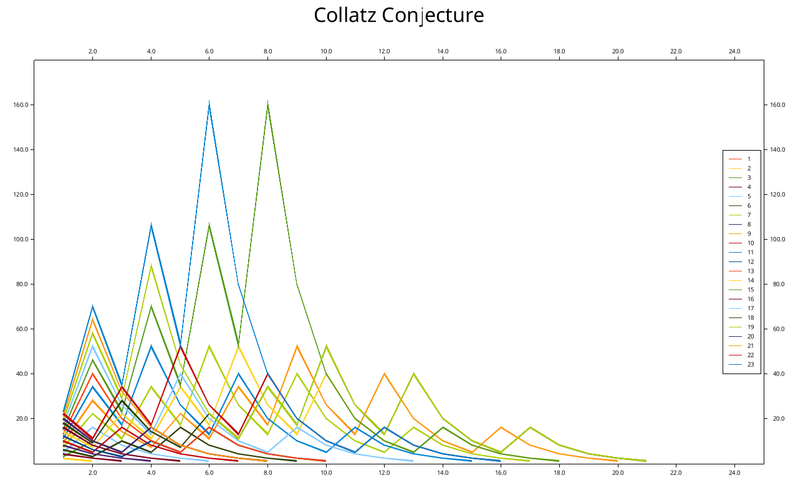

# Collatz Conjecture

Watched:

YouTube Video  
[The Simplest Math Problem No One Can Solve - Collatz Conjecture](
https://youtu.be/094y1Z2wpJg)

## Sample Output



Data

``` text
***** starting_number *****
(step_index, value)

-----------------------------
***** 1 *****
(1, 1)

***** 2 *****
(1, 2)
(2, 1)

***** 3 *****
(1, 3)
(2, 10)
(3, 5)
(4, 16)
(5, 8)
(6, 4)
(7, 2)
(8, 1)

***** 4 *****
(1, 4)
(2, 2)
(3, 1)

***** 5 *****
(1, 5)
(2, 16)
(3, 8)
(4, 4)
(5, 2)
(6, 1)

***** 6 *****
(1, 6)
(2, 3)
(3, 10)
(4, 5)
(5, 16)
(6, 8)
(7, 4)
(8, 2)
(9, 1)

***** 7 *****
(1, 7)
(2, 22)
(3, 11)
(4, 34)
(5, 17)
(6, 52)
(7, 26)
(8, 13)
(9, 40)
(10, 20)
(11, 10)
(12, 5)
(13, 16)
(14, 8)
(15, 4)
(16, 2)
(17, 1)

***** 8 *****
(1, 8)
(2, 4)
(3, 2)
(4, 1)

***** 9 *****
(1, 9)
(2, 28)
(3, 14)
(4, 7)
(5, 22)
(6, 11)
(7, 34)
(8, 17)
(9, 52)
(10, 26)
(11, 13)
(12, 40)
(13, 20)
(14, 10)
(15, 5)
(16, 16)
(17, 8)
(18, 4)
(19, 2)
(20, 1)

***** 10 *****
(1, 10)
(2, 5)
(3, 16)
(4, 8)
(5, 4)
(6, 2)
(7, 1)

***** 11 *****
(1, 11)
(2, 34)
(3, 17)
(4, 52)
(5, 26)
(6, 13)
(7, 40)
(8, 20)
(9, 10)
(10, 5)
(11, 16)
(12, 8)
(13, 4)
(14, 2)
(15, 1)

***** 12 *****
(1, 12)
(2, 6)
(3, 3)
(4, 10)
(5, 5)
(6, 16)
(7, 8)
(8, 4)
(9, 2)
(10, 1)

***** 13 *****
(1, 13)
(2, 40)
(3, 20)
(4, 10)
(5, 5)
(6, 16)
(7, 8)
(8, 4)
(9, 2)
(10, 1)

***** 14 *****
(1, 14)
(2, 7)
(3, 22)
(4, 11)
(5, 34)
(6, 17)
(7, 52)
(8, 26)
(9, 13)
(10, 40)
(11, 20)
(12, 10)
(13, 5)
(14, 16)
(15, 8)
(16, 4)
(17, 2)
(18, 1)

***** 15 *****
(1, 15)
(2, 46)
(3, 23)
(4, 70)
(5, 35)
(6, 106)
(7, 53)
(8, 160)
(9, 80)
(10, 40)
(11, 20)
(12, 10)
(13, 5)
(14, 16)
(15, 8)
(16, 4)
(17, 2)
(18, 1)

***** 16 *****
(1, 16)
(2, 8)
(3, 4)
(4, 2)
(5, 1)

***** 17 *****
(1, 17)
(2, 52)
(3, 26)
(4, 13)
(5, 40)
(6, 20)
(7, 10)
(8, 5)
(9, 16)
(10, 8)
(11, 4)
(12, 2)
(13, 1)

***** 18 *****
(1, 18)
(2, 9)
(3, 28)
(4, 14)
(5, 7)
(6, 22)
(7, 11)
(8, 34)
(9, 17)
(10, 52)
(11, 26)
(12, 13)
(13, 40)
(14, 20)
(15, 10)
(16, 5)
(17, 16)
(18, 8)
(19, 4)
(20, 2)
(21, 1)

***** 19 *****
(1, 19)
(2, 58)
(3, 29)
(4, 88)
(5, 44)
(6, 22)
(7, 11)
(8, 34)
(9, 17)
(10, 52)
(11, 26)
(12, 13)
(13, 40)
(14, 20)
(15, 10)
(16, 5)
(17, 16)
(18, 8)
(19, 4)
(20, 2)
(21, 1)

***** 20 *****
(1, 20)
(2, 10)
(3, 5)
(4, 16)
(5, 8)
(6, 4)
(7, 2)
(8, 1)

***** 21 *****
(1, 21)
(2, 64)
(3, 32)
(4, 16)
(5, 8)
(6, 4)
(7, 2)
(8, 1)

***** 22 *****
(1, 22)
(2, 11)
(3, 34)
(4, 17)
(5, 52)
(6, 26)
(7, 13)
(8, 40)
(9, 20)
(10, 10)
(11, 5)
(12, 16)
(13, 8)
(14, 4)
(15, 2)
(16, 1)

***** 23 *****
(1, 23)
(2, 70)
(3, 35)
(4, 106)
(5, 53)
(6, 160)
(7, 80)
(8, 40)
(9, 20)
(10, 10)
(11, 5)
(12, 16)
(13, 8)
(14, 4)
(15, 2)
(16, 1)

```
